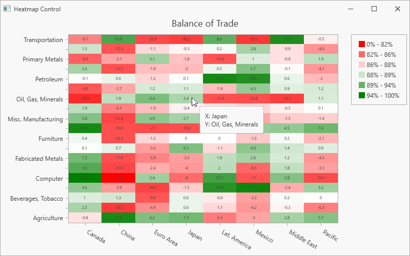

<!-- default badges list -->

<!-- default badges end -->

# Chart for WPF - Create a Heatmap Chart Based on a Data Source

This example shows how to create a heatmap and bind it to a data source. In this example, the heatmap obtains data from an XML file.

To bind a heatmap to a data source, follow the steps below:

- Create a [HeatmapDataSourceAdapter](https://docs.devexpress.com/WPF/DevExpress.Xpf.Charts.Heatmap.HeatmapDataSourceAdapter?v=21.2&p=netframework) object. 

- Specify adapter properties listed below:

    - [DataSource](https://docs.devexpress.com/WPF/DevExpress.Xpf.Charts.Heatmap.HeatmapDataSourceAdapter.DataSource)
    - [ColorDataMember](https://docs.devexpress.com/WPF/DevExpress.Xpf.Charts.Heatmap.HeatmapDataSourceAdapter.ColorDataMember)
    - [XArgumentDataMember](https://docs.devexpress.com/WPF/DevExpress.Xpf.Charts.Heatmap.HeatmapDataSourceAdapter.XArgumentDataMember)
    - [YArgumentDataMember](https://docs.devexpress.com/WPF/DevExpress.Xpf.Charts.Heatmap.HeatmapDataSourceAdapter.YArgumentDataMember)

- Assign the adapter object to the [HeatmapControl.DataAdapter](https://docs.devexpress.com/WPF/DevExpress.Xpf.Charts.Heatmap.HeatmapControl.DataAdapter) property.

<!-- default file list -->
## Files to Review

- [MainWindow.xaml](./CS/MainWindow.xaml) (VB: [MainWindow.xaml](./VB/MainWindow.xaml))
- [MainWindow.xaml.cs](./CS/MainWindow.xaml.cs) (VB: [MainWindow.xaml.vb](./VB/MainWindow.xaml.vb))

<!-- default file list end -->

## Documentation

- [HeatmapControl](https://docs.devexpress.com/WPF/DevExpress.Xpf.Charts.Heatmap.HeatmapControl)

## More Examples

- [How to Create a Heatmap Based on Arrays of String and Numeric Values](https://github.com/DevExpress-Examples/wpf-heatmap-matrix-data)
<!-- feedback -->
## Does this example address your development requirements/objectives?

 

(you will be redirected to DevExpress.com to submit your response)
<!-- feedback end -->
